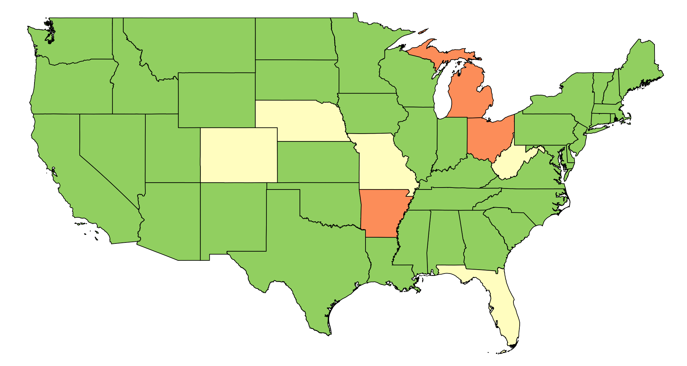
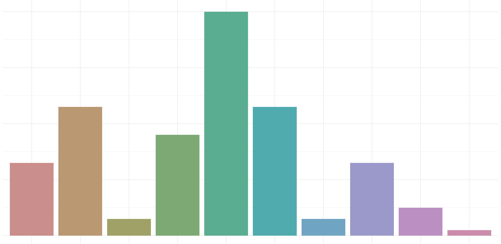
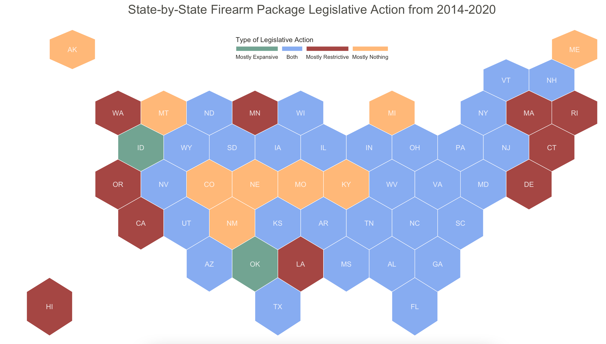

# Firearm Data Visualization
Date created: May 4, 2021
Last updated: November 26, 2022

## Description
These are a series of scripts used to create different charts and data visualizations for a study at 
University of Washington's Harborview Injury Prevention and Research Center. There are six general type of charts created:
* Proportioned line chart
* Proportioned bar chart
* Circle bar chart
* U.S. hexbin map
* U.S. chloropleth map
* Lollipop chart

## Instructions for Use
*Note: Access to the firearm legislative data must be requested.* 

Store the scripts in the same folder as the firearm legislative data. Run each script in RStudio (or your preferred IDE). To export the charts in RStudio, 
click the "Export" button and select which format you would like to export them in. 

## Outputs
All the outputs from these scripts can be accessed in the outputs folder. Some example outputs are shown below:

#### Chloropleth Map

#### Bar Chart

#### Hexbin Map

## Contact
Hayley Pippin  
hayley.pippin@gmail.com
